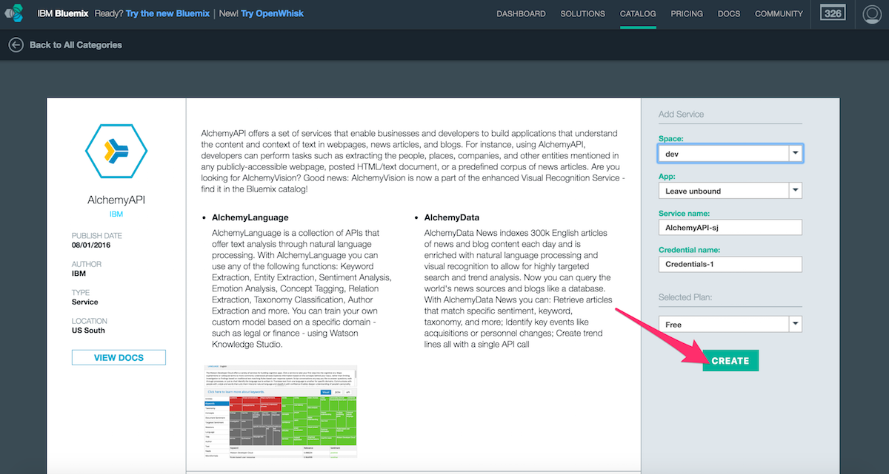
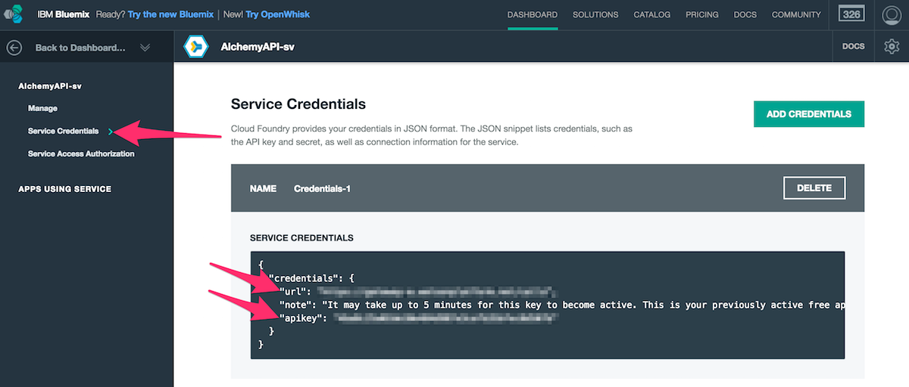

# Alchemy API Setup

If you want your bot to understand and extract locations from statements, you must provide credentials for the Alchemy API service. Follow these steps to obtain your credentials:

## Get Credentials for your Bot

- [Create Alchemy service instance](https://console.ng.bluemix.net/catalog/services/alchemyapi/).

- Navigate to the "Service Credentials" section and find your `HUBOT_WATSON_ALCHEMY_URL` and `HUBOT_WATSON_ALCHEMY_APIKEY`.

