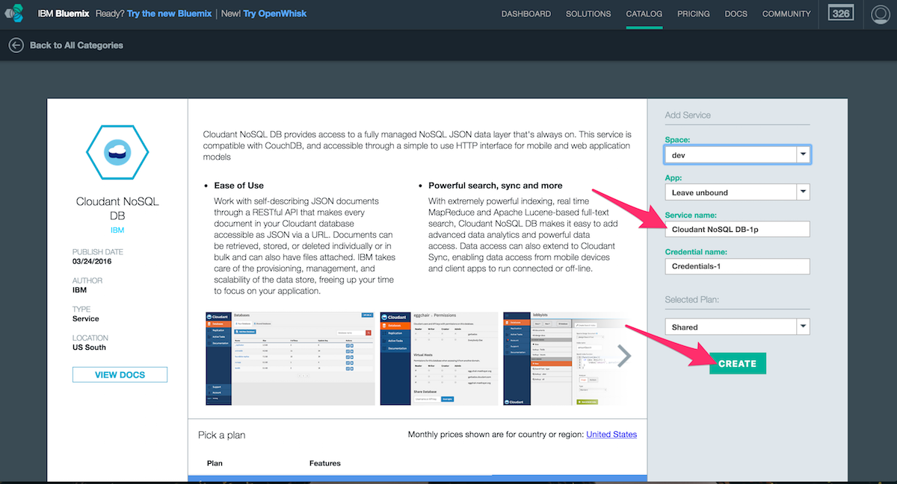
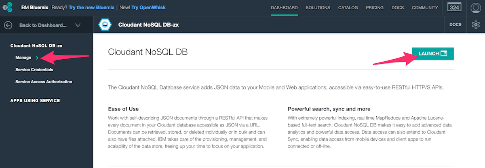
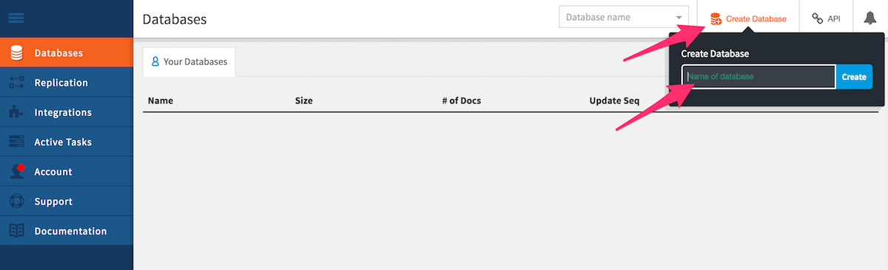
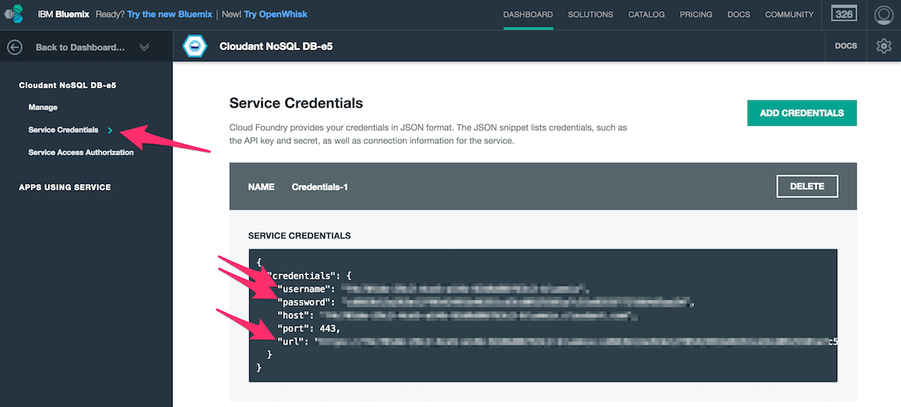
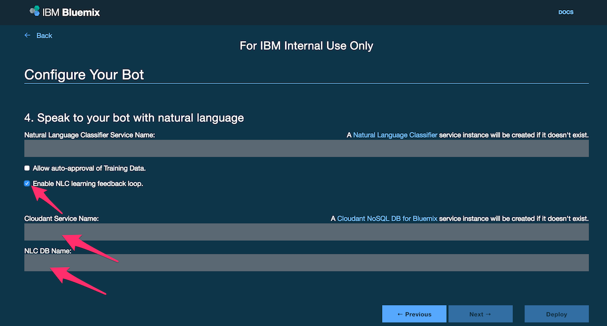

# Cloudant Setup

If you want your bot to include a cognitive learning feedback loop, you must provide credentials for the Cloudant NoSQL DB service. Follow these steps to obtain your credentials:

## Get Credentials for your Bot

- [Create Cloudant service instance](https://console.ng.bluemix.net/catalog/services/cloudant-nosql-db/). Here you can set your service's name.

- Navigate to the "Manage" section and launch your Cloudant service.

- Create a new database and name it accordingly. This will be your `HUBOT_CLOUDANT_DB`.

### For Development
- Navigate to the "Service Credentials" section and find your `HUBOT_CLOUDANT_ENDPOINT`, `HUBOT_CLOUDANT_KEY` and `HUBOT_CLOUDANT_PASSWORD`.

## Configure your Bot

To configure your bot to enable NLC learning feedback loop, provide an existing Cloudant service name and the corresponding database. A new service will be created if it does not exist.

