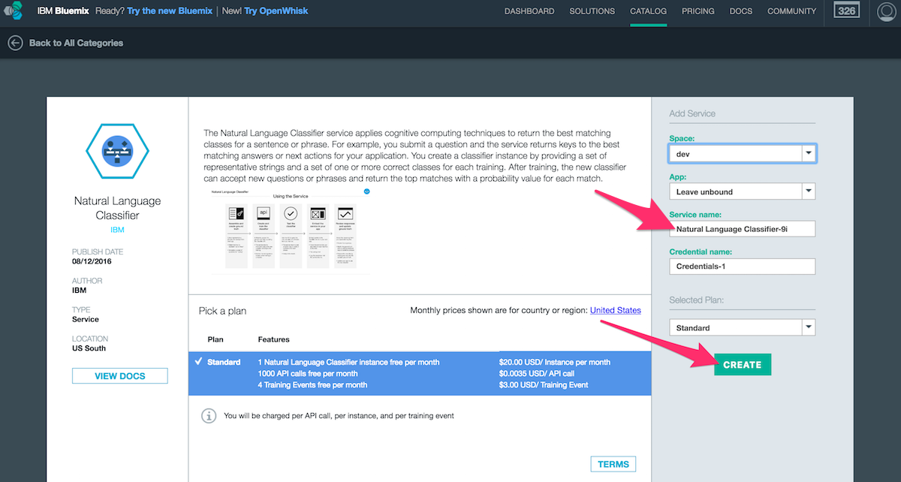
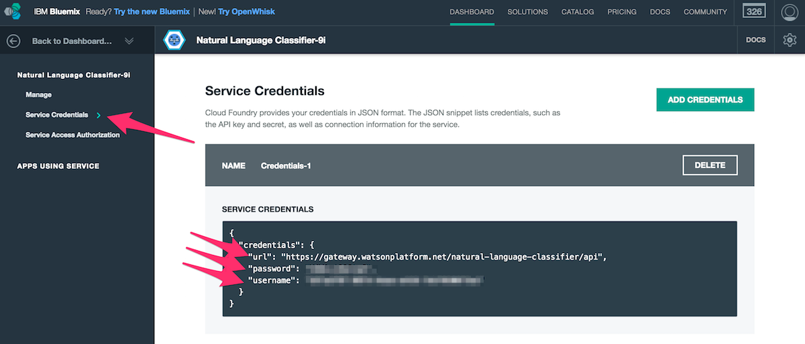
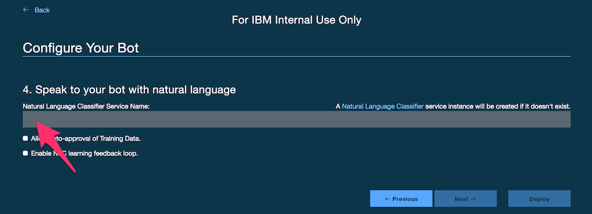

# Watson Natural Language Classifier Setup

If you want your bot to interact with users using natural language, you must provide credentials for the Watson Natural Language Classifier service. Follow these steps to obtain your credentials:

## Get Credentials for your Bot

- [Create Watson NLC service instance](https://console.ng.bluemix.net/catalog/services/natural-language-classifier/). Here you can set your service's name.

### For Development
- Navigate to the "Service Credentials" section and find your `HUBOT_WATSON_NLC_URL`, `HUBOT_WATSON_NLC_USERNAME` and `HUBOT_WATSON_NLC_PASSWORD`.

## Configure your Bot

To configure your bot for natural language integration, provide an existing Watson NLC service name. A new service will be created if it does not exist.

